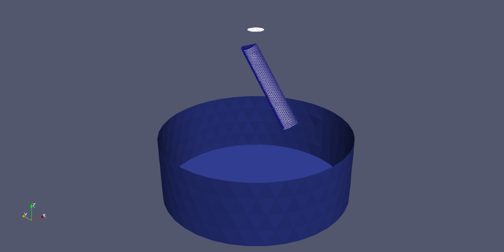
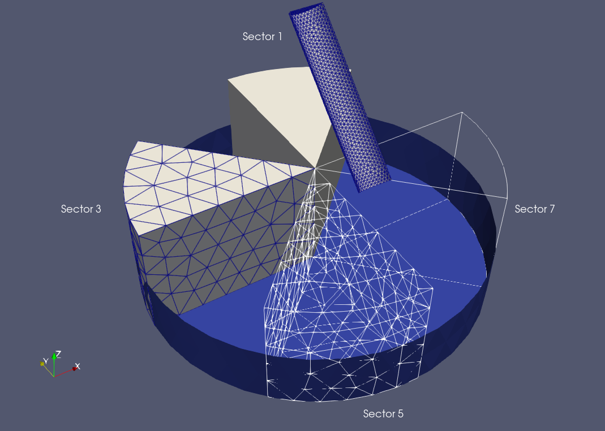
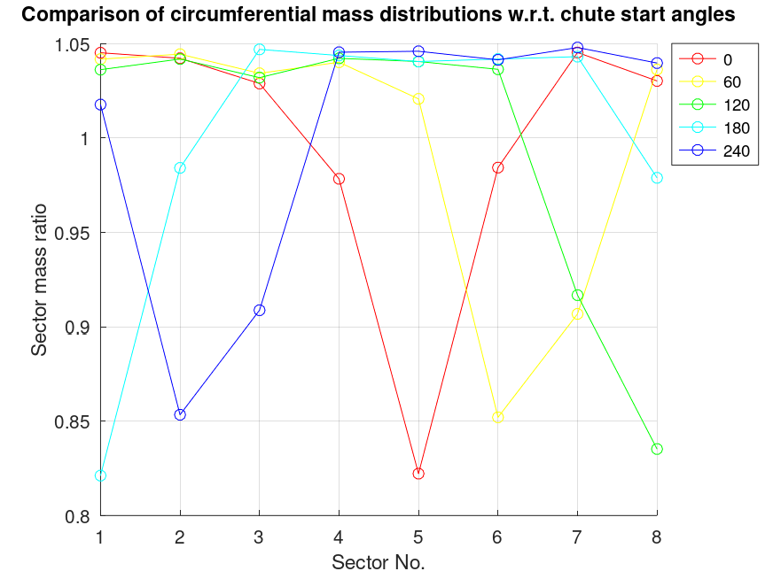
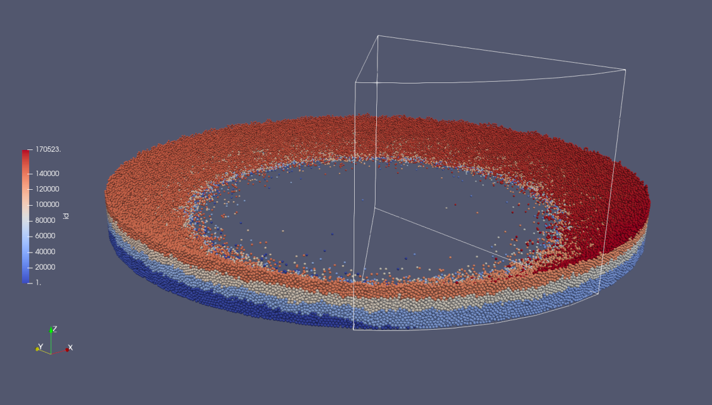
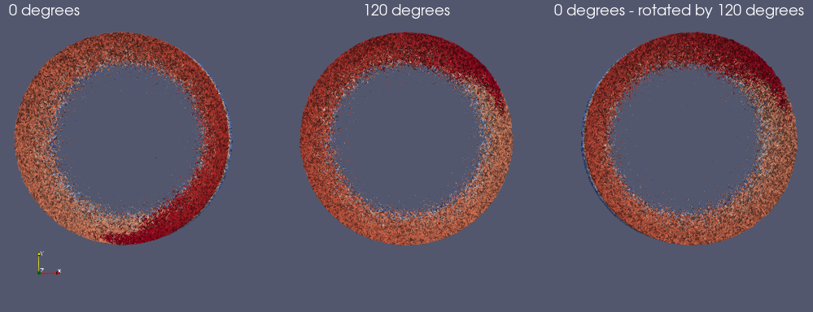

# Effect of chute start angle on the circumferential mass distribution

## Case description

This simulation case is based on the simulation setup used in the paper of
Holzinger and Schatzl. Compared to the simulations of the paper, this
simulation case is much simplified. There are no hoppers for the material,
and the geometry of the chute has been simplified. While these simplifications
respresent a deviation from the simulations of the paper, this case will
nevertheless serve well enough to demonstrate a pertinent question:  
_Does the chute start angle has any influence on the circumferential mass distribution?_

Below, we see the STL surface meshes defining the geometry of this simulation.
The blue mesh represents the blast furnace throat, i.e., the walls and the
surface of the material within the blast furnace. For simplicity, the surface
of the burden material within the blast furnace is assumed to be perfectly flat.

The mesh in grey with blue grid lines is the simplified chute, which is a section
of a cylinder. The mesh in white is the insertion face, through which the particles
are inserted as a steady stream into the simulation. This represents the charged
material flowing from one of the parallel hoppers onto the chute.

The chute is shown in the 0 degrees orientation. Thus in a simulation with a chute
starting angle of 0 degrees, the chute starts rotating from this position. For all
other chute starting angles, the chute is first rotated by a fixed angle and then
the simulation commences.




### Simplifications

We have made several simplifications to simplify the simulations themselves as
well as to remove any concreate data from the industrial plant that the paper
was dealing with.

Actual industrial data (geometric, operating conditions or otherwise) is not
contained in this simulation case.

#### Geometry & operating conditions

The general geometric dimensions in this simulation are near enough to the values
of the geometry used in the paper, however not identical.

Also the operating conditions have been simplified and slightly altered.

The chute now rotates at a constant speed, in the paper its rotational speed was
changed stepwise to follow the data provided by the blast furnace operators.

Also the chute's tilt follows now a significantly simpler profile over time.

#### No hoppers

We have replaced the hoppers from the original simulations with a simple particle
stream at the centre line above the cute. First of all, this removes the need to
fill the hoppers prior to conducting this simulation. Secondly, there's much less
wall geometry involved in this simulation, since there are no hoppers, no hopper
gates and no control devices guiding the particle stream from the hoppers onto the
chute.

Instead of emptying hoppers, we use a particle input stream which is located roughly
where the outlet of the funnel tube is located in the simulation setup of the paper.
This means, that this simulation setup can not be used to study the effect of hopper
change, since there are no hoppers. However, for the purposes of studying the effect
of the chute start angle, this is good enough.

#### Simpler chute geometry

The chute in the simulations of the paper was created from CAD drawings provided
by the industrial partner of the authors. The chute in this simulation is a rough
approximation.


## Results

The image below shows the sectors used in post-processing. These sectors are
defined by volumetric meshes in the VTK format. The image shows every second
sector: Sector 1 in plain grey, Sector 3 in grey with grid lines, Sector 5 is
shown as a wireframe of its surface and Sector 7 is shown by its outline.



In the post-processing stage of the LIGGGHTS simulation, particles are grouped
by the sector they occupy. For each group, the mass is determined as well as the
total mass of the particles. The determined mass values are then written to a
file. Thus, the circumferential mass distribution can be determined.

Below, we see the circumferential mass distribution of the various cases studied
here. The masses of the sectors are normalized by an eighth of the total particle
mass. Each line in the plot is generated from the data of a different chute start
angle. The shape of the curves is very similar, showing a distinct minimum, which
is not coinciding with the minimum of other curves.




Below, we see the final particle distribution of the case for a starting angle
of 0 degrees. The particles are coloured by their ID, reflecting the time they
were entered into the simulation. The lower the ID, the longer they have been
in the simulation. Hence, the blue particles were injected first, thus they form
the lowest layer of particles.

Shown as an outline is Sector 5, which contains the least amount of particles
of all sectors for this simulation. This is clearly reflected by the fact that
the blue layer begins left of this sector, and the red layer ends right of it.
Thus, in terms of the chute's rotation, the first particles were deposited just
after Sector 5 and particle deposition ended just prior to Sector 5.



With particle deposition amounting to slightly less than four full rotations, there
is no chance to achieve an even distribution across all sectors. One could devise
a special case which works out to an integer-multiple of a full-rotation particle
deposition, but that would be just that: a special case.

The point where the first particles are deposited is fully determined by the
chute's start angle, whereas the point where particle deposition ends is determined
by the mass flow rate, the total mass of particles and the chute's rotation.
In this study, the chute's start angle is the only variable between runs, hence
the circumferential mass distribution, e.g., the location of the minimum of the
sector masses, depends on the chute's start angle.

The image below, shows the final particle layers of the 0 degree chute start
angle on the left and of the 120 degree chute start angle in the center. On the
right, there is the data of the 0 degree case rotated in ParaView by 120 degrees.

This rotated 0-degree data is very similar to the 120-degree data. Thus, showing
very clearly the influence of the chute's start angle on the final material
distribution in the blast furnace.




## A note on case running

This simulation case is actually a parameter study. The script `Allrun.sh` contains
a list of start angles:

```startAngles=(0 60 120 180 240 300)```

The script loops over this angles, and for each angle runs a DEM simulation. The
solution data is stored in individual folders.

A post-processing script plots the sectional masses computed at the very end of the
DEM simulation for all chute start angles.


## References

G. Holzinger, M. Schatzl. Effect of chute start angle and hopper change on burden distribution
during the charging process of a bell-less top blast furnace with two parallel hoppers
Powder Technol., 395 (2022), pp. 669-680, 10.1016/j.powtec.2021.10.005


## Software

### Geometry and mesh creation

The meshes for this simulation (STL surface meshes and VTK volumetric meshes) have been
created using [Salome](https://www.salome-platform.org/), which is available under the LGPL.

The resulting meshes are part of the simulation case. No geometry or mesh creation needs
to be done by the user.


### DEM Software

[LIGGGHTS](https://github.com/ParticulateFlow/LIGGGHTS-PFM) is a solver for particulate matter
using the discrete element method (DEM). LIGGGHTS is based on the molecular dynamics (MD) solver
lammps. LIGGGHTS is developed by the PFM department of the JKU Linz and is available under the GPL.

This case has been tested with:

* LIGGGHTS-PFM 23.02


### Pre- and post-processing

Post-processing is done using [Octave](https://www.gnu.org/software/octave/), which is open source
under the GPL and is available for all platforms. 

The post-processing scripts have been tested with:

* GNU Octave, version 7.1.0


